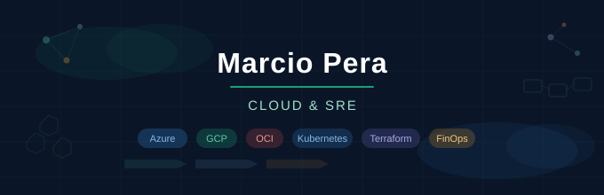

  

  
  
  

---

### 👋 Sobre mim

Sou especialista em **Cloud Computing** com 20 anos de experiência em TI — os últimos 5 focados em ambientes **Multicloud** e **SRE**. Lidero squads na entrega de soluções escaláveis, resilientes e seguras, com foco em performance, automação, confiabilidade e FinOps.

Pós-graduado em **Gestão de TI pela FIAP**, com **7 certificações Microsoft** (incluindo Azure Solutions Architect Expert), **CKA**, **AWS Cloud Practitioner** e título de **Microsoft Certified Trainer**.

---

### 🏆 Resultados de destaque

🔻 **-30% em custos cloud** com iniciativas FinOps — reservas, Savings Plans e escalabilidade automática

⚙️ **Automação end-to-end** de infraestrutura com Terraform, Ansible e Azure DevOps

🔄 **Pipelines CI/CD** com observabilidade avançada, gestão de incidentes e melhoria contínua

☁️ **Migração on-prem → cloud** com ganhos em alta disponibilidade, segurança e DR

---

### 🛠️ Stack & ferramentas

  
  
  
  

  
  
  
  

  
  
  
  

  
  
  
  

---

### 🎓 Certificações

  
  
  
  

> 📎 Todas as certificações verificáveis no **[Credly](https://www.credly.com/users/marciopera)**

---

### 📊 GitHub Stats

  
  

  

---

### ✍️ Conteúdo técnico

Publico regularmente sobre **Cloud**, **SRE**, **FinOps** e **DevOps** no LinkedIn.

📌 **[Ver artigos e posts →](https://www.linkedin.com/in/marciopera/detail/recent-activity/posts/)**

---